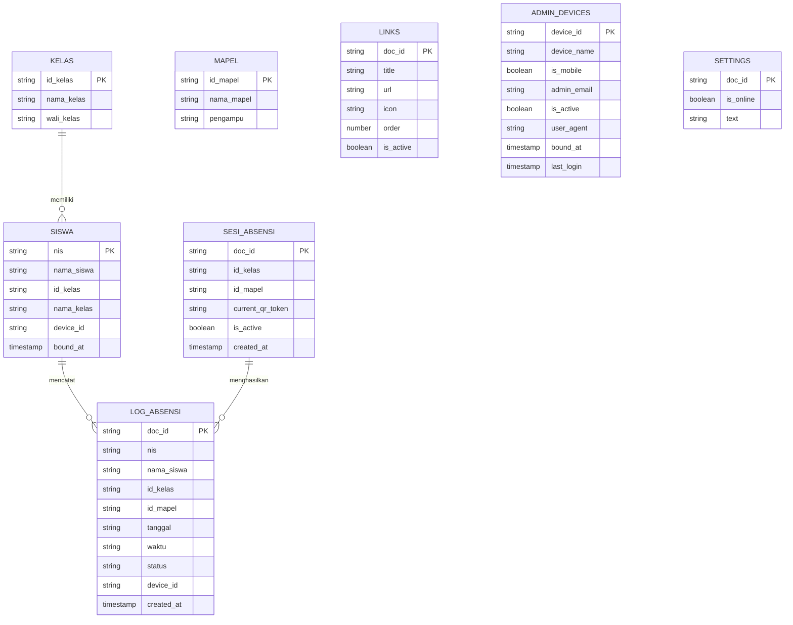

# 🗄️ Dokumentasi Skema Database Cloud Firestore — Portal Iskak Fatoni

Dokumen ini berisi spesifikasi teknis lengkap struktur data, koleksi, field, dan tipe data yang digunakan pada Cloud Firestore proyek Portal Iskak Fatoni.

---

## 📊 Diagram Relasi Entitas (ERD)

---

## 🗂️ Rincian 8 Koleksi & Spesifikasi Field

### 1. Koleksi: `siswa` *(Master Data Siswa)*
- **Doc ID (PK)**: Nomor Induk Siswa (misal: `"1001"`)

| Field | Tipe Data | Keterangan |
| :--- | :--- | :--- |
| `nis` | `String` | Nomor Induk Siswa |
| `nama_siswa` | `String` | Nama lengkap siswa |
| `id_kelas` | `String` | ID / Kode ringkas kelas (misal: `"XII TEI 1"`) |
| `nama_kelas` | `String` | Nama lengkap kelas |
| `device_id` | `String` | Fingerprint hardware HP siswa (misal: `"HW-8F3A..."`) |
| `bound_at` | `Timestamp` | Waktu pengikatan HP siswa |

---

### 2. Koleksi: `kelas` *(Master Data Kelas)*
- **Doc ID (PK)**: ID Kode Kelas (misal: `"XII_TEI_1"`)

| Field | Tipe Data | Keterangan |
| :--- | :--- | :--- |
| `id_kelas` | `String` | Kode ringkas kelas |
| `nama_kelas` | `String` | Nama lengkap kelas |
| `wali_kelas` | `String` | Nama guru wali kelas |

---

### 3. Koleksi: `mapel` *(Master Data Mata Pelajaran)*
- **Doc ID (PK)**: ID Kode Mapel (misal: `"MP_KONTROL_PROSES"`)

| Field | Tipe Data | Keterangan |
| :--- | :--- | :--- |
| `id_mapel` | `String` | Kode ringkas mata pelajaran |
| `nama_mapel` | `String` | Nama mata pelajaran |
| `pengampu` | `String` | Nama guru pengampu |

---

### 4. Koleksi: `links` *(Daftar Tautan Pembelajaran Portal)*
- **Doc ID (PK)**: Auto ID Firestore

| Field | Tipe Data | Keterangan |
| :--- | :--- | :--- |
| `title` | `String` | Judul tautan |
| `url` | `String` | URL link tujuan |
| `icon` | `String` | Class FontAwesome ikon |
| `order` | `Number` | Nomor urut tampilan di portal |
| `is_active` | `Boolean` | Status tampil di portal (`true` / `false`) |

---

### 5. Koleksi: `sesi_absensi` *(Sesi QR Presensi Active Guru)*
- **Doc ID (PK)**: Auto ID Firestore

| Field | Tipe Data | Keterangan |
| :--- | :--- | :--- |
| `id_kelas` | `String` | Kelas target presensi |
| `id_mapel` | `String` | Mata pelajaran sesi presensi |
| `current_qr_token` | `String` | Token dinamis QR Code |
| `is_active` | `Boolean` | Status sesi presensi (`true` = Buka, `false` = Ditutup) |
| `created_at` | `Timestamp` | Waktu sesi dibuat |

---

### 6. Koleksi: `log_absensi` *(Riwayat Presensi Siswa)*
- **Doc ID (PK)**: Auto ID Firestore

| Field | Tipe Data | Keterangan |
| :--- | :--- | :--- |
| `nis` | `String` | NIS siswa |
| `nama_siswa` | `String` | Nama siswa |
| `id_kelas` | `String` | Kode kelas |
| `id_mapel` | `String` | Kode mapel |
| `tanggal` | `String` | Tanggal presensi (`YYYY-MM-DD`) |
| `waktu` | `String` | Waktu presensi (`HH:mm:ss`) |
| `status` | `String` | Status (`"HADIR"`, `"IZIN"`, `"SAKIT"`, `"ALPA"`) |
| `device_id` | `String` | Hardware ID HP siswa saat presensi |
| `created_at` | `Timestamp` | Server timestamp presensi |

---

### 7. Koleksi: `admin_devices` *(Perangkat Admin Terikat & History Login)*
- **Doc ID (PK)**: Hardware Fingerprint Admin (misal: `"HW-8F3A9C12B4D5E6F7"`)

| Field | Tipe Data | Keterangan |
| :--- | :--- | :--- |
| `device_id` | `String` | Hardware ID unik admin |
| `device_name` | `String` | Tipe/model perangkat (`📱 Mobile` / `💻 Desktop`) |
| `is_mobile` | `Boolean` | Flag perangkat seluler (`true`) atau desktop (`false`) |
| `admin_email` | `String` | Email admin pengikat |
| `is_active` | `Boolean` | Status izin auto-login (`true` / `false`) |
| `user_agent` | `String` | User agent browser |
| `bound_at` | `Timestamp` | Waktu pertama diikat |
| `last_login` | `Timestamp` | Timestamp login terakhir |

---

### 8. Koleksi: `settings` *(Pengaturan Global)*
| Document ID | Field | Tipe Data | Keterangan |
| :--- | :--- | :--- | :--- |
| `portal_status` | `is_online` | `Boolean` | Status portal online/offline |
| `announcement` | `text` | `String` | Teks running text di portal |
